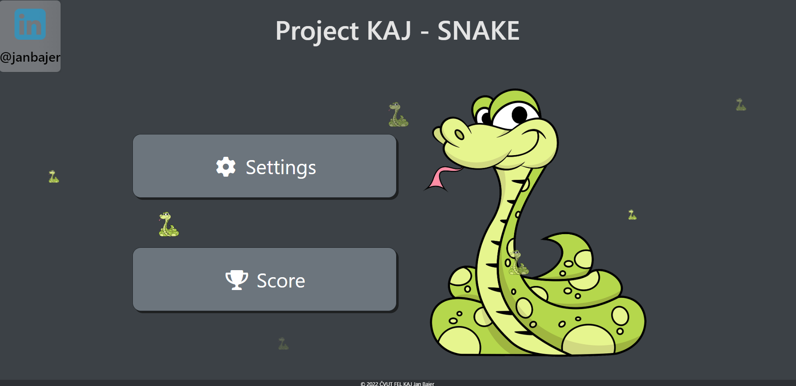
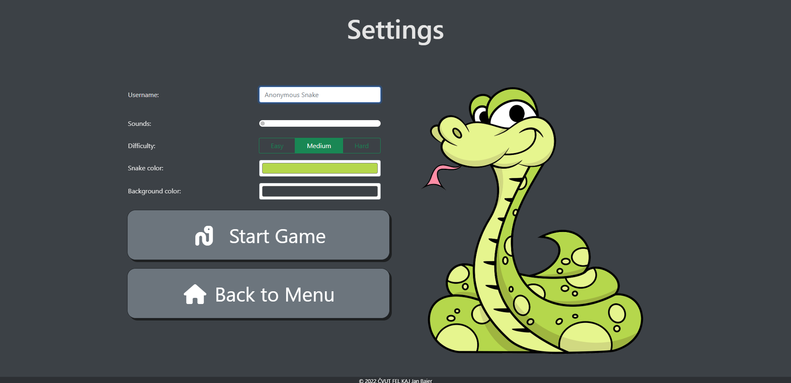
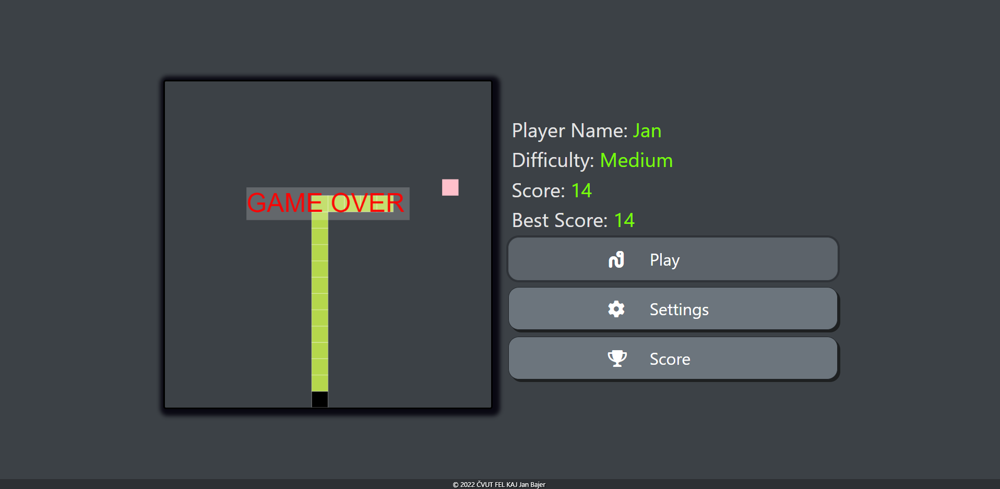
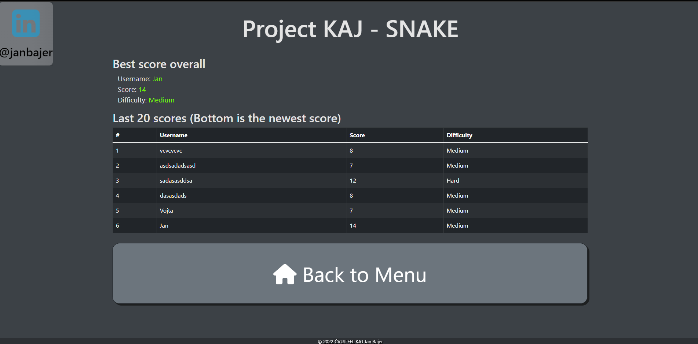

# Snake-in-REACT
School for project - first experience with REACT

Live demo using github pages: 
https://janbajer.github.io/Snake-in-REACT/

Postup:
- Nejdříve jsem hru udělal v plain javascriptu. V 8. týdnu jsem se rozhodl, že bych se mohl naučit React, tak jsem to předělal, nicméně spíše mi to přineslo více starostí. Například v JS je několik návodu jak pracovat s history API, nicméně k Reactu jsem našel pouze návody kde se používá useHistory(), což teď už v nové verzi není podporováno a místo toho je nový hook, s kterým se mi to úplně nepodařilo. V kódu je několik komentů.
- Používám bootstrap pro CSS a některé componenty

###### HTML 5
- ✔️ Validita - https://validator.w3.org
- ✔️ Validita - Testoval jsem to v ostatních prohlížečích a fungovalo mi to
- ✔️ Semantické značky - Já používám footer a poté i header,  použil jsem hlavně GRID pro rozložení. Nicméně aspoň jsem nepoužil ty sémantické značky špatně 😄 
- ✔️ Grafika - (SVG / Canvas) - používám canvas
- ✔️ Média - Audio/Video - zvuky při snězení jablka, game over
- ✔️ Formulářové prvky - mám tam stránku SETTINGS - validace jména, placeholder, required, autofocus, typy: text, switch, radio, color
- ✔️ Offline aplikace  

###### CSS
- ✔️ Pokročilé selektory - např.: order a nth-child() v Game když je obrazovka menší než 1000px // hover buttony // Hierarchické vztahy, sjednocení // když je formulář :checked

- ❔ Vendor prefixy - Nedal jsem to do semestrálky, ale mám vysvětlení. Na přednášce bylo řečeno, že se snaží o "odprefixování" webu a přišlo mi, že se mi to nějak nehodí. Vím, že bych tam mohl dát něco jako: div { -webkit-transform: rotate(45deg); }}, ale pro mojí semestrálku jsem nenašel vhodné uplatnění. 
- ✔️ CSS3 transformace 2D/3D - Vytvořil jsem Flip card, kterou jsem dal na hlavní obrazovku (a na obrazovku SCORE) do horního levého rohu. Při hoveru se  otočí o 180stupňů a když není hover tak se otočí zpět o 180 stupňů. Dále když je hover na buttony, tak tam je translateY(5px), translateX(5px) s tím, že ty buttony mají 5 px box shadow, čímž jsem se snažil o to, že to vypadá jako že se ten čudlík zmáčkne.

- ✔️ CSS3 transitions/animations - mám tam animaci na hlavní stránce kdy hadi jdou ze spodka screenu nahoru, na buttonech transitions aby to vypadalo více smooth, na flip card je také transition aby to nebylo instantní 
- ✔️ Media queries - např.: v Game.css - podle obrazovky je rozložení stránky, Stránka funguje i na menších obrazovkách (nerozpadá se)

###### Javascript
- ✔️ OOP přístup - Je to v reactu, mám tam různé componenty
- ✔️ Použití JS frameworku či knihovny - REACT
- ✔️ Použití pokročilých JS API - local storage
- ❔ Funkční historie - dá se přesouvat zpět/vpřed podle history, nicméně nejde vidět jaká stránka to přesně byla. Snažil jsem se zjistit, jak se to v REACTU dělá (docela dlouho 😥), ale na řešení jsem nenarazil, protože jsou akorát na návody jak to udělat, že se k tomu používá hook useHistory(), který je už zastaralý a nedá se využít.
- :x: Ovládání medií
- :x: Offline aplikace
- :x: JS práce se SVG

###### Ostatní - Tohle je hlavně na Vás, ale snažil jsem se, aby ta aplikace vypadala dobře 😄
- ✔️ Kompletnost řešení 
- ✔️ Estetické zpracování

Menu

Settings

Game

Score

